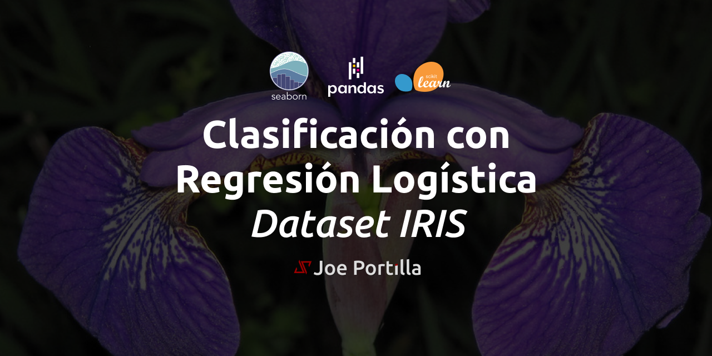

# Clasificando el Dataset Iris con Regresión Logística

El dataset `Iris` es un conjunto de datos de clasificación multiclase clásico y muy sencillo. Introducido por el estadístico y biólogo británico Ronald Fisher en su artículo de 1936 "The use of multiple measurements in taxonomic problems". El conjunto de datos de Iris contiene cuatro características (longitud y anchura de sépalos y pétalos) de 50 muestras de tres especies de flores Iris (Iris setosa, Iris virginica e Iris versicolor).

Tras realizar un [análisis exploratorio de datos](https://www.kaggle.com/code/joeportilla/analisis-exploratorio-de-datos-dataset-iris/) para comprender mejor la información. En este notebook se construye un modelo con Regresión Logística que utiliza las características para clasificar las flores con un máximo de precisión.

## Paquetes utilizados:
- Procesamiento de datos: Pandas.
- Procesamiento numérico: NumPy.
- Visualización de datos: Seaborn y Matplotlib.
- Desarrollo de Modelo: Scikit Learn

## Referencias:
- [Wikipedia](https://es.wikipedia.org/wiki/Conjunto_de_datos_flor_iris)
- [UCI Machine Learning Repository](https://archive.ics.uci.edu/ml/datasets/Iris/)

## Instructor:
Joseph Santiago Portilla - Ingeniero Electrónico.
- GitHub: https://github.com/JoePortilla
- Twitter: https://twitter.com/JoePortilla
- LinkedIn: https://www.linkedin.com/in/PortillaJoe
- Kaggle: https://www.kaggle.com/joeportilla
